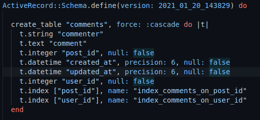

# Blog App

> A super-basic blog app made with rails and run in sql, app working for create a article, delete it, see it and comment it

## Built With

- HTML
- ERB
- SCSS
- Ruby
- JavaScript
- CSS
- SQL

### Prerequisites

  Text Editor (VSCode is suggested.)
  Ruby
  Rails
  Bundler
  Yarn
  SQL

## Getting Started

To get a local copy up and running follow these simple example steps:
- Fork this project
- Open your terminal
- Clone this project `git clone git@github.com:helman101/blog-app.git`
- Go to the project folder `cd blog-app`

### Install

- Run `bundle install`
- Migrate de database `rails db:migrate`

### Run tests

- Run `rails s`  or  `rails server`
- Now go to  http://localhost:3000
- You will see the project working! 

## Authors

👤 **Author1**

- Github: [@helman101](https://github.com/helman101)
- Linkedin: [Linkedin](https://www.linkedin.com/in/helman101/)

👤 **Author2**

- GitHub: [@githubhandle](https://github.com/githubhandle)
- Twitter: [@twitterhandle](https://twitter.com/twitterhandle)
- LinkedIn: [LinkedIn](https://linkedin.com/linkedinhandle)

## 🤝 Contributing

Contributions, issues and feature requests are welcome! Start by:

- Forking the project
- Cloning the project to your local machine
- `cd` into the project directory
- Run `git checkout -b your-branch-name`
- Make your contributions
- Push your branch up to your forked repository
- Open a Pull Request with a detailed description to the development branch of the original project for a review

## Show your support

Give a ⭐️ if you like this project!

## Acknowledgments

- Thanks to Odin project for the tutorials.

## 📝 License

This project is [MIT](lic.url) licensed.
